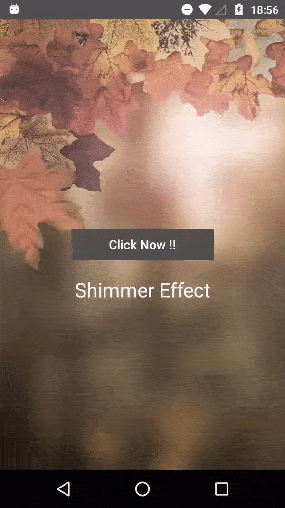

# ShimmerButton
Add a shimmer effect to any view in your Android app using FB Shimmer Library.
Shimmer highlight always depends on the color of the view's background but using this you can customize the color of your shimmer.




  
Implement the below FACEBOOK library :
  
 ``` implementation 'com.facebook.shimmer:shimmer:0.4.0' ```
 
 Use the below layout in XML to create a shimmer effect :
 
 ```
 <?xml version="1.0" encoding="utf-8"?>
<RelativeLayout xmlns:android="http://schemas.android.com/apk/res/android"
    xmlns:app="http://schemas.android.com/apk/res-auto"
    xmlns:tools="http://schemas.android.com/tools"
    android:layout_width="match_parent"
    android:layout_height="match_parent"
    tools:context=".MainActivity"
    android:orientation="vertical">

    <ImageView
        android:layout_width="match_parent"
        android:layout_height="match_parent"
        android:src="@drawable/blur_bg"
        android:scaleType="fitXY"/>

    <!-- White Shimmer effect on Button-->
    <RelativeLayout
        android:id="@+id/white_shimmer_rl"
        android:layout_width="wrap_content"
        android:layout_height="wrap_content"
        android:layout_marginTop="140dp"
        android:layout_centerHorizontal="true"
        android:layout_centerVertical="true">

        <com.facebook.shimmer.ShimmerFrameLayout
            android:id="@+id/shimmer_view_container1"
            android:layout_width="wrap_content"
            android:layout_height="wrap_content"
            android:elevation="4dp"
            app:shimmer_base_alpha="1"
            app:shimmer_duration="3000"
            app:shimmer_highlight_alpha="0.4"
            app:shimmer_tilt="180">

            <Button
                android:layout_width="180dp"
                android:layout_height="40dp"
                android:background="@drawable/primary_round_button_bg"
                android:elevation="4dp"
                android:text="Click Now !!"
                android:textAllCaps="false"
                android:textColor="@color/white"
                android:textSize="16sp" />

        </com.facebook.shimmer.ShimmerFrameLayout>

        <!-- Background in this will be used as shimmer highlight color -->
        <Button
            android:layout_width="180dp"
            android:layout_height="39dp"
            android:elevation="3dp"
            android:background="@drawable/white_round_button_bg"/>

    </RelativeLayout>

    <!-- Shimmer effect on Textview -->
    <com.facebook.shimmer.ShimmerFrameLayout
        android:id="@+id/shimmer_view_container3"
        android:layout_width="wrap_content"
        android:layout_height="wrap_content"
        android:layout_centerHorizontal="true"
        app:shimmer_base_alpha="1"
        app:shimmer_duration="2500"
        app:shimmer_highlight_alpha="0.2"
        app:shimmer_tilt="180"
        android:layout_gravity="center"
        android:layout_marginTop="20dp"
        android:layout_below="@+id/white_shimmer_rl">

        <TextView
            android:layout_width="wrap_content"
            android:layout_height="wrap_content"
            android:elevation="4dp"
            android:text="Shimmer Effect"
            android:textAllCaps="false"
            android:textColor="@android:color/white"
            android:textSize="25sp" />

    </com.facebook.shimmer.ShimmerFrameLayout>


</RelativeLayout>
 ```
 

